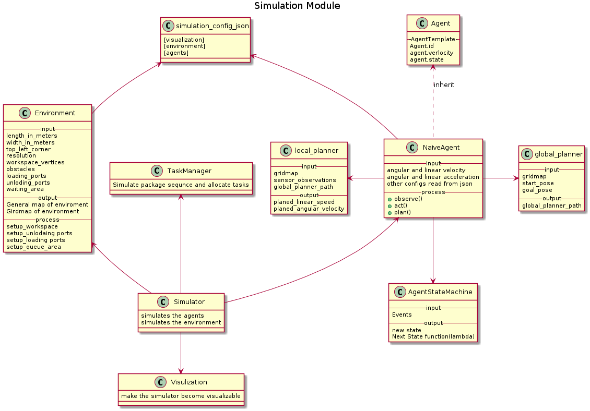
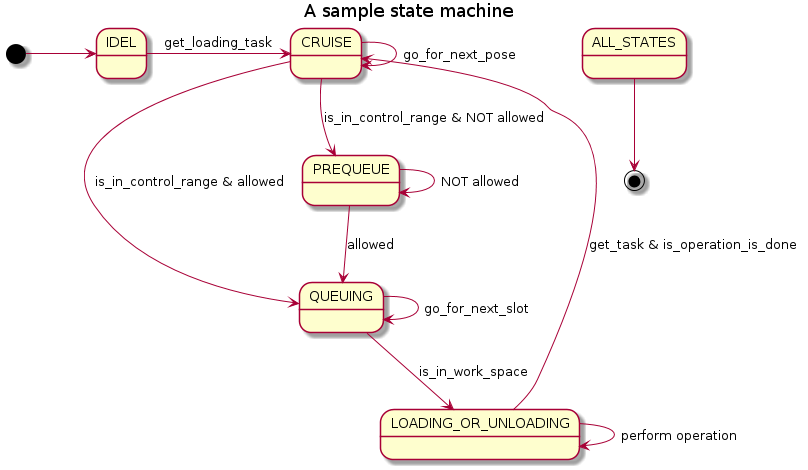

# Licence
Shenzhen Dorabot Inc. (“Dorabot”) is willing to license the software identified below to you only
under condition that you accept all of the terms contained in this license agreement (“Agreement”).
By using Dorabot Minions software, downloading or installing this software or data obtained with
this software you accept the terms of this Agreement.
If you are not a member of a public funded academic and/or education and/or research institution
you must obtain a commercial license from Dorabot (Info@dorabot.com).
You can get more details by reading LICENCE.
# Introduction
This repository provides a simulation environment for prototyping opertions research algorithms and other high-level path-finding algorithms for multiagent systems in logistics sorting scenarios. 

The repository also contains implementations of some sample algorithms.

# File strcuture
```
Dorabot-Minions-Platform
|
|
|―― src (python source codes)
    |―― simulator.py (entrance of starting a simulator)
    |―― server.py (in charge of task distribution and some centralized planning algorithm)
    |―― environment.py (model workspace and functional areas)
    |―― queue.py
    |―― geometry.py, shape.py (geometry-related files)
    |―― visualisation.py
    |―― config.json (configuration file)
    |―― contro.py (entrance of starting a control panel)
    |―― interaction_handler.py
    |
    |―― agents
    |   |―― agent.py (agent template)
    |   |―― agent_state_machine.py (a sample implementation of agent state machine, see Fig.2)
    |   |―― naive_agent.py (a basic sample agent)
    |   |―― sensor.py
    |
    |―― global_planners (according to global-local architecture)
    |   |―― global_planner.py (global planner template)
    |   |―― sample_global_planner.py (a sample implementation of basic A*)
    |   |―― layered_astar_planner.py (a A* algorithm with weight inflation)
    |   |―― rrtstar_planner.py (a RRT* algorithm)
    |   |―― multiagent_planner_local_entry.py (local entry point for multiagent global algorithm)
    |
    |―― multiagent_global_planners (according to global-local architecture)
    |   |―― inash_planner.py
    |   |―― marrtstar_planner.py
    |
    |―― local_planners
    |   |―― local_planner.py (local planer template)
    |   |―― virtual_force_planner.py (implementation of potential field methods)
    |   |―― flc_local_planner.py
    |
    |―― representation
    |   |―― gridmap.py (a data structure for grids-based representation)
    |   |―― continuous_space.py (collision check for continuous-space-based algorithm)
    |
    |―― task_managers (responsible for task allocation)
    |   |―― task_manager.py (task manager template)
    |   |―― naive_task_manager.py (a sample implementation)
    |
    |―― template (template for local/global planners)
    |
    |―― protocol (communication data structure between simulator and control panel)
    |
    |―― map (predefined map)
```

# Installation
First, please make sure you have successfully installed python2.7. 
To run the simulation, it requires the following dependencies. You can install them by "apt-get install" or "pip install" in Debian OS(tested)
- swig, you should use "sudo apt-get install swig" to install swig first

You can use 'pip' to install following easily, for example "pip install networkx"
- networkx [for graph-based algorithms]
- shapely (for computational geometry in 2D space)
- pygame (for visualisation only)
- pybox2d (physical engine base on box2d, should be installed from the source)
- enum34
- cmd2 (for interactive control panel)
- protobuf (for data communication between processes)

You may also need to install numpy, pandas and matplotlib.

## MacOS
If you are using MacOS and encounter installation problems with swig or pybox2d, please try to install on conda virtual environment instead.

0. Make sure you already install conda.
1. Create a conda virtual environment
```batch
 conda create --name yourEnvironmentName python=2.7 
```
Activate the virtual environment.
```batch
 conda activate yourEnvironmentName
```
2. Install requried packages in virtual environment
Please use swig==3.0.10. Remeber to install all the other packages mentioned above.
```batch
 conda install -c conda-forge swig==3.0.10
 conda install -c https://conda.anaconda.org/kne pybox2d
```

3. Hints on conda virtual environment
List all created environments
```batch
 conda env list
```
Enter an environment (depends on your conda version)
```batch
 conda activate yourEnvironmentName
```
or
```batch
 source activate yourEnvironmentName
```
Leave an environment
```batch
 source deactivate
```
#### Important Note on MacOS
If you encounter segmentation fault related to pygame and subprocess, please go to ```/Users/<your name>/anaconda/envs/<your virtual environment name>/lib/python2.7/site-packages/matplotlib/mpl-data/matplotlibrc``` (path may be different, please find the corresponding file in your virtual environment folder), uncomment and change the backend to agg:
```batch
backend : agg
```

# Run the simulator
```batch
 cd src
 python simulator.py 
```
Press Q/q for exit.

You can let the simulator run for a certain time interval with the following command: 
 - python simulator.py -t [num] ([num] specifies the length of the time interval in minutes in the simulation world)
 - For example, the command python simulator.py -t 60 will run the simulation for 60 miniutes (note, the time is in simulation world) 

## [Other useful interaction control](USER_MANUAL.md)

# To Users
## Set user's specific value in config.json
- You can change all the values in this configuration file. However, it is highly recommended that the value of the "resoultion" field should be set to "1" (default).
- If you set ports on top or bottom, the unloading or loading ports number must be smaller than the integer of floor(width / 3)

## Set the ports location in environment 
In the simulator.py file
```python
def set_environment(self):
    self.environment = Environment()
    self.environment.create_gridmap()
    self.environment.setup_walls()
    '''Choose ports setup place here'''
    self.environment.setup_loading_ports_on_row()
    self.environment.setup_unloading_ports_on_bottom()
    return self.environment

```
- Port locations can be changed via the following functions: 
  - For loading ports
     * You can use setup_loading_ports_on_row(int row=0) to place ports along a row specified by the parameter (the default 0 refers to the top row).                       
     * Or you can use setup_loading_ports_on_horizontal() to place half of the ports on top and half on bottom
  - For unloading ports
     * You can use setup_unloading_ports_on_bottom() to setup ports along the bottom row. 
     * Or you can use setup_unloading_ports_in_mid() to setup ports along the middle row.  

## Customise local planners and global planners
In the simulator.py file
```python
        general_local_planner = FLCPlanner
        general_global_planner = LayeredAStar
```
- You can choose different planners here.
- If you want to implement you own planner, you should go to the local_planners, global_planners or multiagent_global_planners folders to create you own planners.
- Right now, the agent has orientation, but the orientation of agent may confuse some local planners. You can set the angular velocity to a sufficently large value (e.g., > 2 * pi)to avoid unexpected behaviors of agents

## Customise high-level state transitions of agent
- To test high-level control logics, you may want to create an state machine for the agent (a sample implementation is provided in agent_state_machine.py)

## Customise task allocation algorithms
- A sample implementaion is provided in the file task_managers/naive_task_manager.py

# NOTE
We only use pygame built-in primitive shapes for visualization as they only support integers and will automatically round float numbers.

# UML of or-mars-prototype modules

# A sample state machine implemented in agent_state_machine.py
- Each state corresponds to a state of the underlying system.
- Each state transition corresponds to an atomic transitional function that does something and will modify the state upone completion

